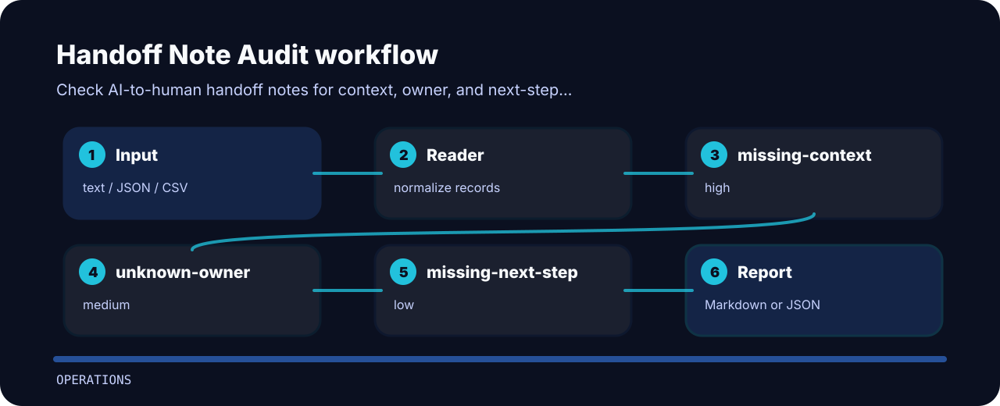

# Handoff Note Audit

| Field | Value |
| --- | --- |
| Area | operations |
| Command | `handoff-note-audit` |
| Example | `examples/sample.txt` |


Check AI-to-human handoff notes for context, owner, and next-step gaps. The command is intentionally direct so it can sit in a local review, a CI step, or a one-off audit.

## Signals

- `missing-context` - handoff context is missing (high); Summarize what happened and what was tried..
- `unknown-owner` - handoff owner is missing (medium); Route to a named team or queue..
- `missing-next-step` - next step is missing (low); Add the recommended next action..

## Policy flow



## One-pass run

```bash
git clone https://github.com/mertefekurt/handoff-note-audit.git
cd handoff-note-audit
python -m pip install -e ".[dev]"
handoff-note-audit examples/sample.txt
```
